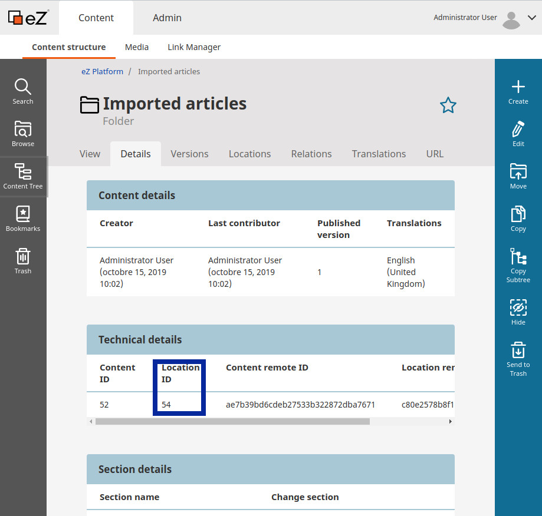
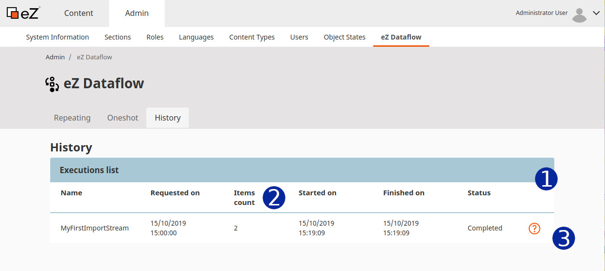
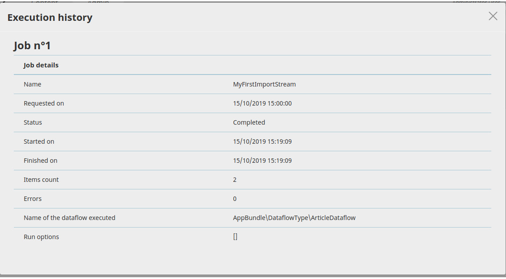
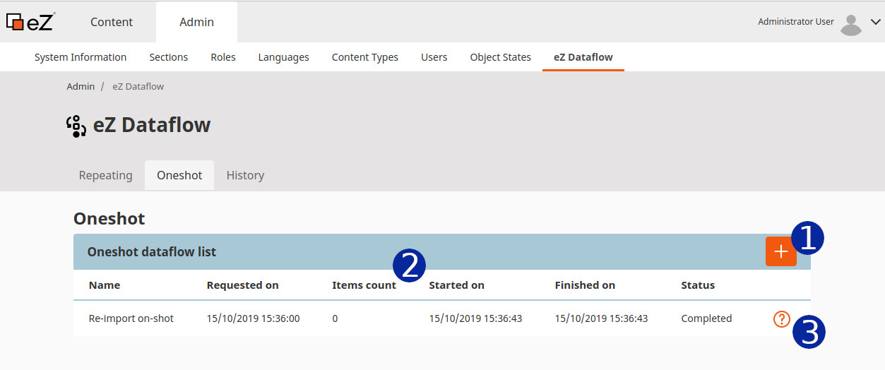
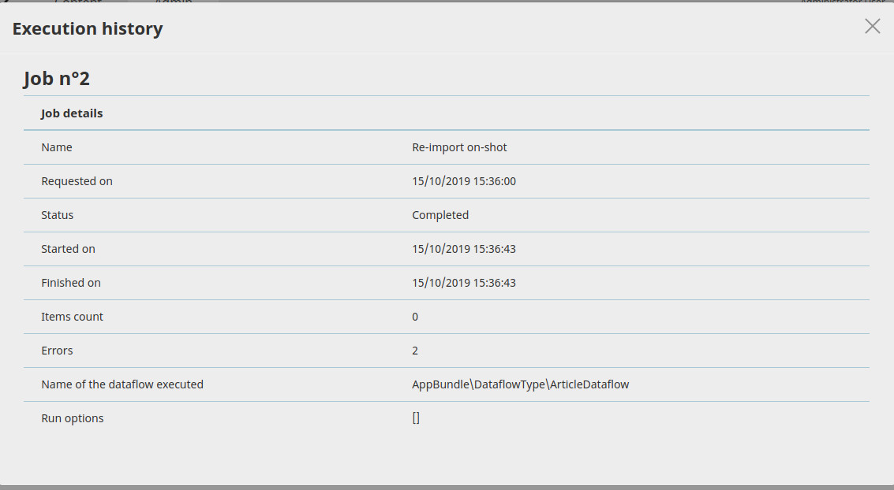
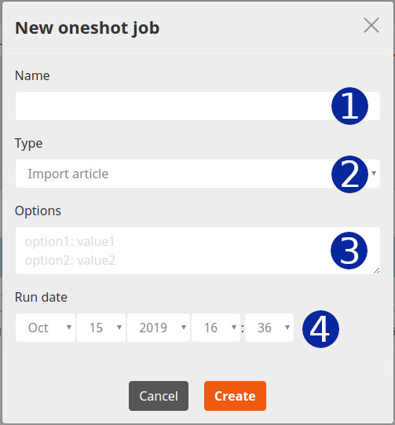

# Code Rhapsodie eZ Dataflow Bundle

EzDataflowBundle is a bundle to integrate the Code Rhapsodie Dataflow bundle into eZ Platfom 2.0+.
These dataflows can be piloted from an interface integrated in eZ Platform backoffice.
EzDataflow bundle intends to manage content imports from external data sources.

## User Interface (UI)

The UI lets you create workflow processes from any defined `DataflowTypes`, and set options to each.

Processes can be set to run either:
- only once, at a given date and time
- regularly, by defining the first run date and time, and the interval between subsequent runs

## Installation

### Step 1: Install the bundle via composer

```shell script
$ composer require code-rhapsodie/ezdataflow-bundle
```

### Step 2: Enable the bundle

#### Symfony 4 (new tree)

For Symfony 4, add those two lines in the `config/bundles.php` file:

```php
<?php

return [
     // ...
    CodeRhapsodie\DataflowBundle\CodeRhapsodieDataflowBundle::class => ['all' => true],
    CodeRhapsodie\EzDataflowBundle\CodeRhapsodieEzDataflowBundle::class => ['all' => true],
    // ...
];
```

#### Symfony 3.4 (old tree)

For Symfony 3.4, add those two lines in the `app/AppKernel.php` file:

```php
<?php
// app/AppKernel.php

public function registerBundles()
{
    $bundles = [
        // ...
        new CodeRhapsodie\DataflowBundle\CodeRhapsodieDataflowBundle(),
        new CodeRhapsodie\EzDataflowBundle\CodeRhapsodieEzDataflowBundle(),
        // ...
    ];
}
```

### Step 3: Import bundle routing file

```yaml
# app/config/routing.yml or config/routing.yaml

_cr.dataflow:
    resource: '@CodeRhapsodieEzDataflowBundle/Resources/config/routing.yaml'
```

### Step 4: Update the database schema

Please refer to the [Code-Rhapsodie Dataflow Bundle installation guide](https://github.com/code-rhapsodie/dataflow-bundle#update-the-database).

### Step 5: Schedule the job runner

Please refer to the [Code-Rhapsodie Dataflow Bundle Queue section](https://github.com/code-rhapsodie/dataflow-bundle#queue).

## Configuration

By default, the `ContentWriter` will publish contents using the `admin` user. If you want to use another user (with sufficient permissions), you can configure it like this:

```yaml
# app/config/config.yml or config/packages/code_rhapsodie_ez_dataflow.yaml

code_rhapsodie_ez_dataflow:
    # Integer values are assumed to be user ids, non-integer values are assumed to be user logins
    admin_login_or_id: webmaster
```

## Define your Dataflow

Before using the admin UI to manage your dataflows, you need to define them. Please refer to [Code-Rhapsodie Dataflow type documentation](https://github.com/code-rhapsodie/dataflow-bundle#define-a-dataflow-type).

## Use the ContentWriter

To add or update content in your Ez content, you can use  the `CodeRhapsodie\EzDataflowBundle\Writer\ContentWriter` writer.

### Step 1: Inject the dependencie and add the writer

Inject the `ContentWriter` service into the constructor of your DataflowType and add the content writter into the writer list like this:

```php
// In your DataflowType

use CodeRhapsodie\EzDataflowBundle\Writer\ContentWriter;
use CodeRhapsodie\DataflowBundle\DataflowType\AbstractDataflowType;
[...]

class MyDataflowType extends AbstractDataflowType
{
    //[...]
    /**
     * @var ContentWriter
     */
    private $contentWriter;

    public function __construct(ContentWriter $contentWriter)
    {
        $this->contentWriter = $contentWriter;
    }
    //[...]
    protected function buildDataflow(DataflowBuilder $builder, array $options): void
    {
        //[...]
        $builder->addWriter($this->contentWriter);
    }
}
```

### Step 2: Add a step for prepare the content

To process eZ Platform content into your Dataflow, you need transform the data in objet `ContentCreateStructure` or `ContentUpdateStructure`
for create or update content respectively.

But, for determine if the content exist or not, you need search into the eZ Platform content.

One way is use the remote id for search the content.

In the following example, the remote id pattern is `article-<id>` with the `<id>` replaced by the data id provided by the reader.
For check if the content exist or not, I use the service `ContentService` provided by eZ Platform.

The step is added with anonymous function and has 3 types of return:

* When the step return `false`, the data is dropped.
* When the step return a `ContentCreateStructure`, the data will be saved into en new eZ Platform content.
* When the step return a `ContentUpdateStructure`, the data will be saved into the existing eZ Platform content in overwriting all defined fields.

For the new content, you must provide one or more "parent location id" in the 3th argument of the `ContentCreateStructure` constructor.

In this exemple, I have add a new folder for store all articles.

For get the location id of the parent eZ Platform content, go to the admin UI and select the future parent content, click on the details tabs, and read the "Location id" like this:



> Note: the best practice is to define this parent id in your `parameter.yml` file or your `.env.local` file for each execution environment.

```php
// In your DataflowType

use CodeRhapsodie\EzDataflowBundle\Writer\ContentWriter;
use CodeRhapsodie\DataflowBundle\DataflowType\AbstractDataflowType;
use eZ\Publish\API\Repository\ContentService;
[...]

class MyDataflowType extends AbstractDataflowType
{
    //[...]
    /**
     * @var ContentWriter
     */
    private $contentWriter;

    /**
     * @var ContentService
     */
    private $contentService;

    public function __construct(ContentWriter $contentWriter, ContentService $contentService)
    {
        $this->contentWriter = $contentWriter;
        $this->contentService = $contentService;
    }
    //[...]
    protected function buildDataflow(DataflowBuilder $builder, array $options): void
    {
        //[...]
        $builder->addStep(function ($data) {
            if (!isset($data['id'])) {
                return false;
            }

            $remoteId = sprintf('article-%d', $data['id']);
            unset($data['id']);

            $parent_location_for_new_article = 54;

            $lang = 'eng-GB';
            try {
                $content = $this->contentService->loadContentByRemoteId($remoteId);
                $struct = ContentUpdateStructure::createForContentId($content->id, $lang, $data);
            } catch (NotFoundException $e) {
                $struct = new ContentCreateStructure(
                    'article',
                    $lang
                    [$parent_location_for_new_article],
                    $data,
                    $remoteId,
                );
            }


            return $struct;
        });
        $builder->addWriter($this->contentWriter);
    }
}
```

# Admin UI

## Access to the eZ Dataflow UI

You can access to the eZ Dataflow administation UI from your eZ Platform admin back-office.


1. Click to "Admin"
1. Click to "eZ Dataflow"

## Add a new schedule

Go to the eZ Dataflow admin, and click on the "+" orange button. 

Il the new popin, complete the fields:


1. Type the Dataflow name
1. Select the Dataflow type. The list is automaticaly generated from the list of Symfony service with the tags `coderhapsodie.dataflow.type`. If your dataflow type is not present, [check the configuration](https://github.com/code-rhapsodie/dataflow-bundle#check-if-your-dataflowtype-is-ready)
1. Type here the Dataflow options. Format: one option per line and option name and value with `:` separator.
1. Type here the frequency. The value must be compatible with the the PHP [strtotime](https://www.php.net/manual/en/function.strtotime.php) function.
1. Choice the date and time of the first job.
1. Check if you want run this Dataflow.

Finally, click on the "Create" button.

## Read the history

When you click on the "History" tab in the eZ Dataflow admin UI, you view the job history for all Dataflow configured and executed.



1. The history list
1. This column shows the number of objects that have been processed.
1. Click on the question mark for display the job details.

Details of one scheduled job:



## One-shot job

If you don't want run a Dataflow periodically, you can add a single execution at the time and date what you want.

Go to the eZ Dataflow admin UI and click on the "Oneshot" tabs.



1. This button allows you to define the one-shot job (see below).
1. This column shows the number of objects that have been processed.
1. Click on the question mark to display the job details.

Details of one-shot job:



Here the job has fail.

## Add a one-shot job

Go to the eZ Dataflow admin UI and click on the "Oneshot" tabs. Click to the "+" orange button to open the adding popin.



1. Type the Dataflow name
1. Select the Dataflow type. The list is automaticaly generated from the list of Symfony service with the tags `coderhapsodie.dataflow.type`. If your dataflow type is not present, [check the configuration](https://github.com/code-rhapsodie/dataflow-bundle#check-if-your-dataflowtype-is-ready)
1. Type here the Dataflow options. Basic expected format: one option per line and option name and value separated with `:`. For more complex options, the whole YAML format is supported.
1. Choose the date and time of the first job.

Finally, click on the "Create" button.

# Issues and feature requests

Please report issues and request features at https://github.com/code-rhapsodie/dataflow-bundle/issues.

# Contributing

Contributions are very welcome. Please see [CONTRIBUTING.md](CONTRIBUTING.md) for
details. Thanks to [everyone who has contributed](https://github.com/code-rhapsodie/dataflow-bundle/graphs/contributors)
already.

# License

This package is licensed under the [MIT license](LICENSE).

